# НарядAI — веб-панель

Веб-клиент системы электронных нарядов на ремонт оборудования горно-обогатительного предприятия («Костанайские минералы»). Мастер выдаёт и закрывает наряды, исполнитель ведёт свои работы, руководитель видит аналитику, прогноз отказов, аномалии и рейтинги, администратор управляет пользователями и справочниками. Встроенный AI-помощник отвечает на вопросы о производстве текстом или голосом на русском и казахском.

Backend — [naryad-ai-backend](../naryad-ai-backend): REST + JWT, Socket.IO, локальные модели (Ollama, Whisper).

| | |
|---|---|
| Стек | React 19, Vite 8, React Router 7, TanStack Query 5, Tailwind CSS 4 |
| Формы | React Hook Form + Zod 4 |
| Графики | ApexCharts |
| Realtime | Socket.IO client 4 |
| Языки | русский / казахский (`src/locales/ru.json`, `kk.json`), переключение без перезагрузки |
| Офлайн | очередь действий по нарядам в `localStorage`, досылка с `clientActionId` |
| Голос | запись через `MediaRecorder`, распознавание на сервере (Whisper) |

## Демо

**https://hack.fenixkst.kz/login** — вход по номеру телефона и паролю.

| Телефон | Пароль | Роль | Имя |
|---|---|---|---|
| `+77000000003` | `936624` | Администратор | Администратор системы |
| `+77000000002` | `748768` | Руководитель | Исмаилов Тимур Кайратович |
| `+77000000001` | `731013` | Мастер | Нурланов Арман Болатович |
| `+77000000004` | `230522` | Мастер | Ковалёв Сергей Петрович |
| `+77000000101` | `029580` | Исполнитель | Ахметов Ерлан Серикович |
| `+77000000102` | `616514` | Исполнитель | Жумабаев Данияр Ерланович |
| `+77000000103` | `435198` | Исполнитель | Петров Андрей Викторович |
| `+77000000104` | `608245` | Исполнитель | Сагинтаев Нурлан Маратович |
| `+77000000105` | `778010` | Исполнитель | Ким Вадим Олегович |
| `+77000000106` | `798817` | Исполнитель | Оспанов Бауыржан Канатович |
| `+77000000107` | `008636` | Исполнитель | Иванов Сергей Николаевич |
| `+77000000108` | `563857` | Исполнитель | Тулегенов Арман Болатович |
| `+77000000109` | `036991` | Исполнитель | Мухамеджанов Ержан Талгатович |
| `+77000000110` | `976913` | Исполнитель | Шевченко Олег Петрович |
| `+77000000111` | `859643` | Исполнитель | Касымов Руслан Айдарович |
| `+77000000112` | `524646` | Исполнитель | Абдрахманов Тимур Нурланович |
| `+77000000113` | `835042` | Исполнитель | Литвиненко Игорь Васильевич |
| `+77000000114` | `088212` | Исполнитель | Есенов Медет Жанатович |
| `+77000000115` | `758888` | Исполнитель | Смагулов Айбек Кайратович |

Аккаунты и пароли создаются сидом backend (`prisma/seed.ts`, `DEMO_PASSWORDS`). Мастер, руководитель и админ попадают на панель смены, исполнитель — на свои наряды.

---

## Содержание

1. [Экраны](#1-экраны)
2. [Роли и доступ](#2-роли-и-доступ)
3. [Архитектура](#3-архитектура)
4. [Ключевые механизмы](#4-ключевые-механизмы)
5. [Установка и запуск](#5-установка-и-запуск)
6. [Конфигурация](#6-конфигурация)
7. [Используемые API](#7-используемые-api)

---

## 1. Экраны

### Панель смены — `/dashboard`

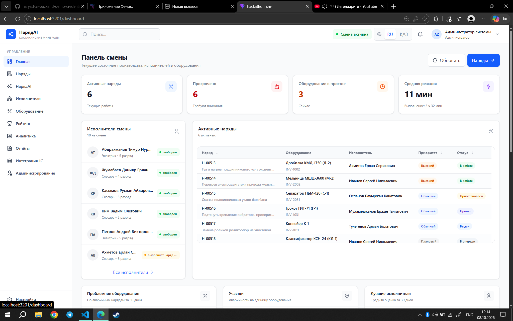

Главный экран мастера и руководителя:
- KPI смены: активные наряды, просроченные, оборудование в простое, среднее время реакции и выполнения;
- исполнители смены с живым статусом: «свободен», «выполняет наряд …», «в очереди N нарядов»;
- таблица активных нарядов с приоритетом и статусом;
- проблемное оборудование (по аварийным нарядам за 30 дней), аварийность по участкам, лучшие исполнители.

### Наряды — `/orders`

**Канбан.** Колонки «В очереди», «Принятые», «В работе», «Выполненные», «Просроченные». Карточку можно перетащить в другую колонку: интерфейс сам выбирает действие (`ACCEPT`, `QUEUE`, `START`, `COMPLETE` …) по текущему статусу наряда и роли (`src/pages/orders/Orders/kanbanMoves.js`). Если нужна причина (пауза, отказ), откроется окно комментария. Колонка «Просроченные» только для просмотра.

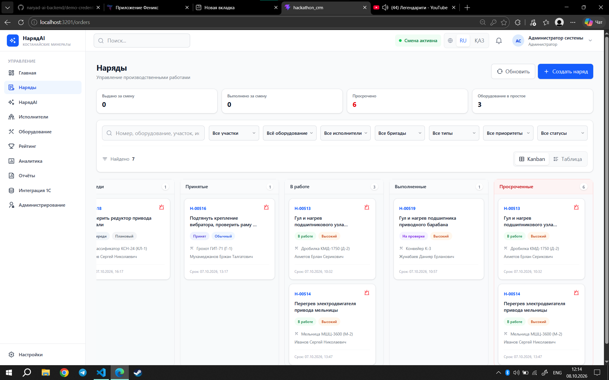

**Таблица.** Сортировка, фильтры по участку, оборудованию, исполнителю, бригаде, типу, приоритету и статусу, полнотекстовый поиск. Сверху счётчики смены: выдано, выполнено, просрочено, в простое.

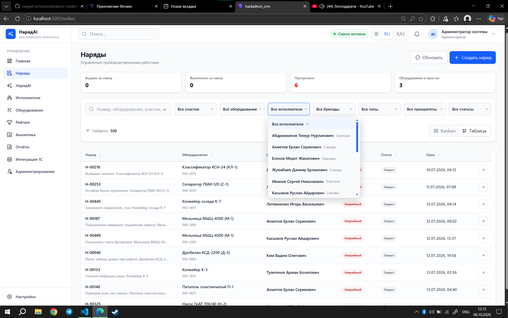

Кнопка «Создать наряд» открывает форму: тип (плановый / аварийный), приоритет, участок → оборудование, исполнитель или бригада, норматив и срок.

### Карточка наряда — `/orders/:id`

Вкладки «Обзор», «История», «Оценка / отчёт»:
- информация: участок, оборудование, тип, норматив, описание неисправности, последний комментарий;
- сроки (создан, принят, закрыт, срок) и плашка «Наряд просрочен»;
- кнопки действий по статусу: принять, в очередь, отклонить, начать, пауза, возобновить, завершить, закрыть, на доработку, отменить;
- **завершение работы**: текст отчёта (можно надиктовать), шифр неисправности, фактические материалы, фото «до» и «после»; после отправки идёт AI-проверка;
- **AI-проверка**: вердикт, что сделано хорошо, что улучшить, замечания; мастер закрывает наряд с оценкой или возвращает на доработку;
- переназначение с подбором исполнителя по оборудованию (очередь и балл каждого кандидата);
- комментарии без смены статуса, история событий, отчёт по наряду в PDF.

### НарядAI — `/assistant`

AI-помощник по нарядам, оборудованию, сотрудникам и аналитике. Быстрые запросы: «Кто свободен?», «Что просрочено?», «Как прошла смена?», «Покажи аномалии», «Прогноз отказов», «Сформируй отчёт за неделю». Можно спрашивать своими словами, на русском или казахском.

Голосовой ввод: запись с живой волной и таймером, текст распознаётся на сервере и подставляется в поле.

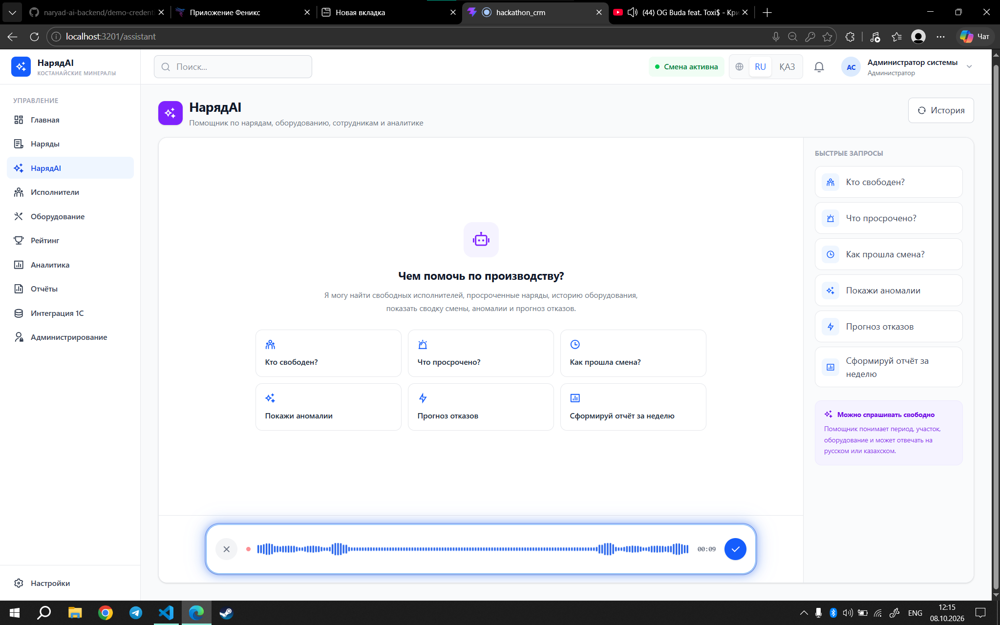

Ответ содержит текст и структурированные карточки: аномалии с оценкой важности и рекомендацией, наряды, исполнители, простой. История диалога сохраняется на сервере.

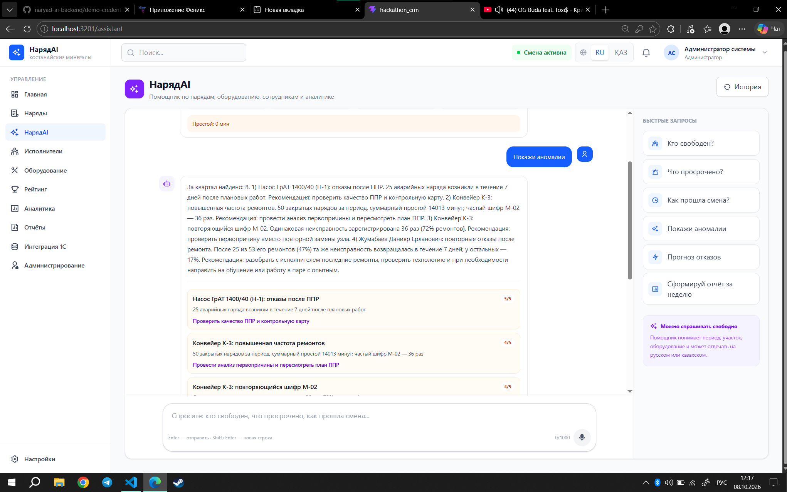

### Исполнители — `/employees`

Счётчики: всего, свободны, заняты, не на смене. Поиск по ФИО, специальности и разряду, фильтры по специальности, статусу и смене. Вид карточками или таблицей с числом активных нарядов. Добавление исполнителя.

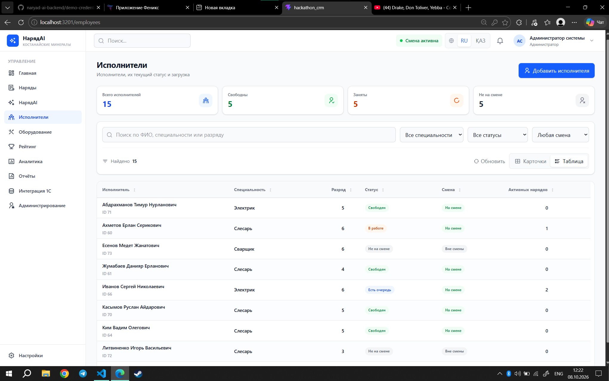

Карточка исполнителя (`/employees/:id`): специальность, разряд, смена, текущие и просроченные наряды.

### Оборудование — `/equipment`

Всё оборудование с инвентарным номером, типом, критичностью (1–5) и участком. Фильтры по участку, типу, критичности; карточки или таблица.

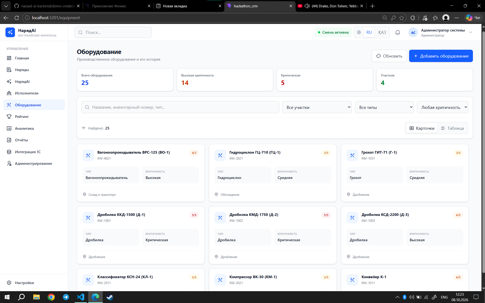

Карточка единицы (`/equipment/:id`): простой, активные наряды, история ремонтов (шифр, приоритет, статус, материалы), AI-оценка качества, QR-код для наклейки. Сканирование QR открывает ту же карточку: ссылка с токеном проверяется на сервере (`EquipmentEntry.jsx`).

### Рейтинг — `/rating`

Период: смена, неделя, месяц. KPI: лучший и средний рейтинг, доля выполненных в срок, число закрытых нарядов. Подиум топ-3 и таблица с составляющими: качество, в срок, доработки, повторные отказы, производительность. Переключатель «Исполнители / Бригады». Исполнитель видит свой рейтинг.

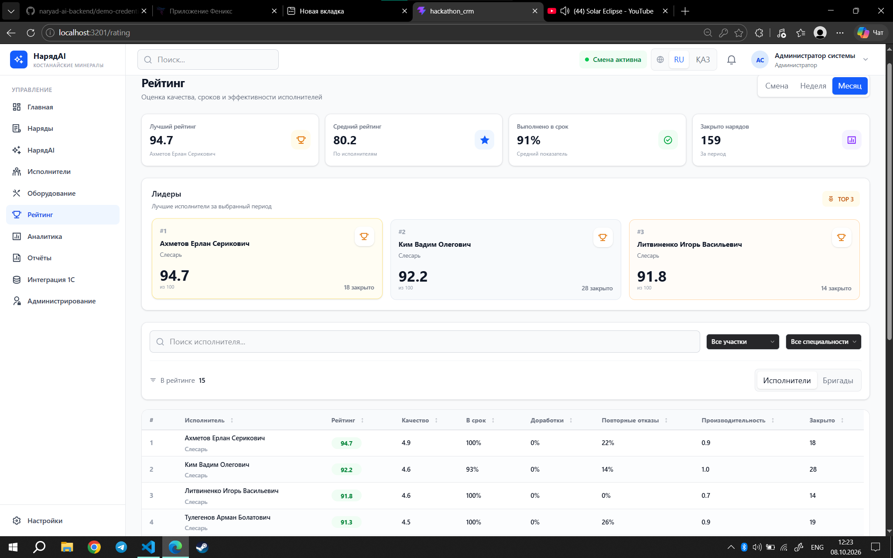

### Аналитика — `/analytics`

Периоды: смена, день, неделя, 30 дней; фильтр по участку и типу аномалии.
- KPI: закрыто, в работе, просрочено, общий простой, средняя реакция;
- загрузка смены: на смене / заняты / свободны / в простое, процент загрузки и доля закрытых;
- **AI-сводка** периода, сформированная сервером;
- **прогноз отказов** на 7 дней с вероятностью по каждой единице;
- **аномалии** с оценкой важности и рекомендацией; кнопка «Пересчитать аномалии».

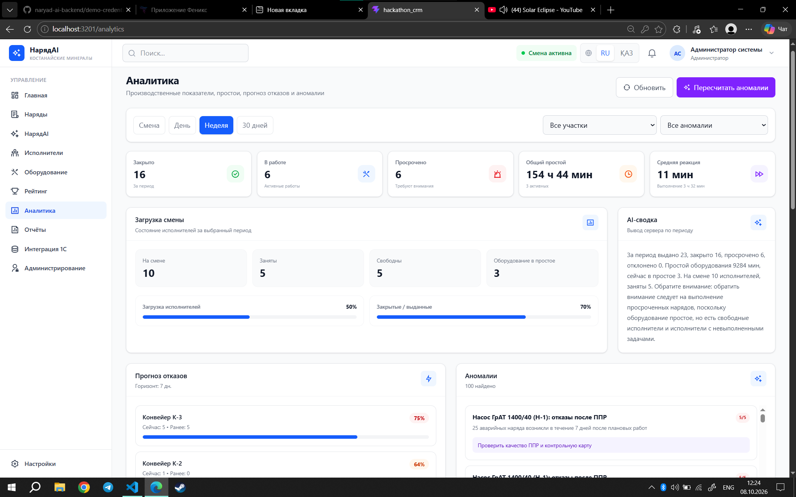

### Отчёты — `/reports`

Типы: отчёт по смене, наряды, рейтинг исполнителей, рейтинг бригад, материалы (расход против норматива), простои, аномалии. Период, даты, участок, оборудование, исполнитель, бригада. Предпросмотр с AI-выводом и выгрузка в **PDF** и **Excel**.

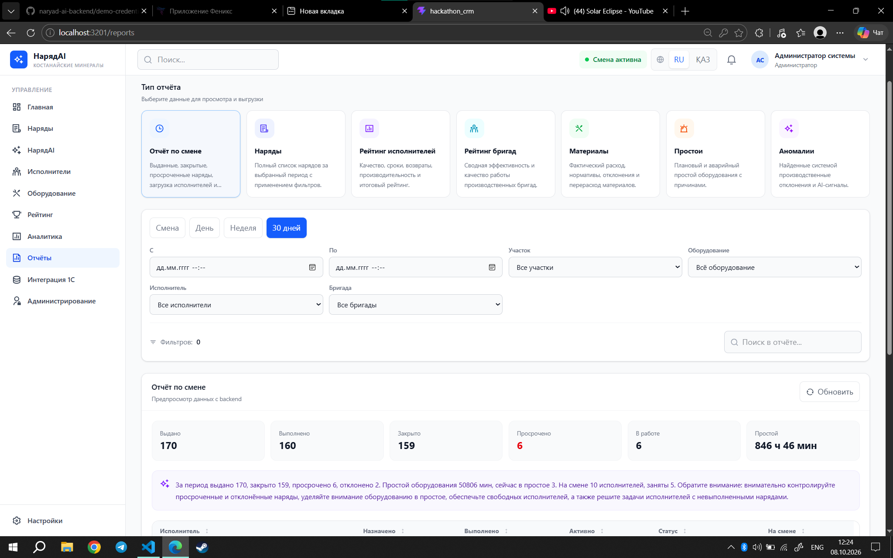

### Интеграция с 1С — `/integrations/1c`

Мониторинг обмена: в очереди, отправляется, доставлено, с ошибками. Вкладки:
- «Задания обмена»: направление, сущность, событие, локальный и внешний ID, попытки, время следующей попытки, ручной повтор;
- «Соответствия 1С»: связь локальных записей с внешними ID;
- «Сверка нарядов».

Кнопки «Выгрузить наряды» и «Запустить обмен».

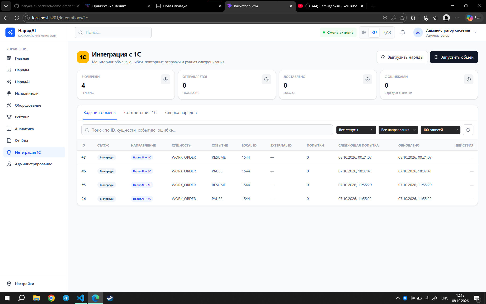

### Администрирование — `/admin`

Пользователи, смены, участки, оборудование, шифры неисправностей, материалы, бригады, нормативы: создание, правка, удаление. Пользователей заводит только администратор, публичной регистрации нет. Для исполнителя можно открыть и закрыть смену.

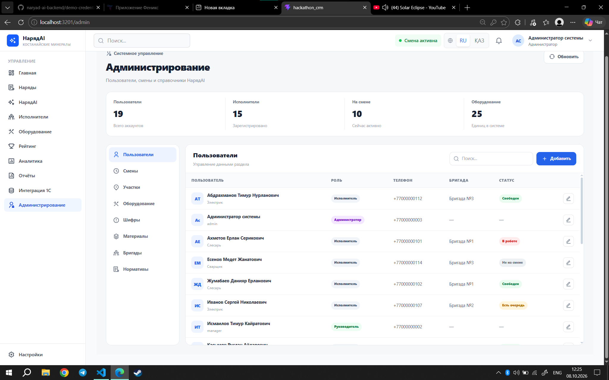

### Вход и настройки

- `/login` — вход по номеру телефона и паролю. При частых попытках сервер возвращает `429`, и форма показывает обратный отсчёт по `Retry-After`.
- `/settings` — профиль (ФИО, телефон), роль, специальность, разряд, бригада, логин 1С, язык интерфейса (Русский / Қазақша), смена пароля.

Во всех экранах в шапке: глобальный поиск, индикатор смены, переключатель RU / ҚАЗ, колокольчик уведомлений, меню профиля.

---

## 2. Роли и доступ

Права заданы в одном месте, `src/auth/roles.js`; меню, роуты и вкладки берут их оттуда.

| Раздел | Исполнитель | Мастер | Руководитель | Админ |
|---|:-:|:-:|:-:|:-:|
| Наряды, оборудование, рейтинг, настройки | ✅ (наряды — только свои) | ✅ | ✅ | ✅ |
| Панель смены, НарядAI, исполнители, аналитика, отчёты | — | ✅ | ✅ | ✅ |
| Интеграция 1С | — | — | ✅ | ✅ |
| Администрирование | — | — | — | ✅ |
| Создание, правка, переназначение, закрытие нарядов | — | ✅ | — | ✅ |

Домашняя страница: `/dashboard` для мастера, руководителя и админа, `/orders` для исполнителя. При попытке открыть недоступный раздел `RoleRoute` переводит на домашнюю страницу роли.

---

## 3. Архитектура

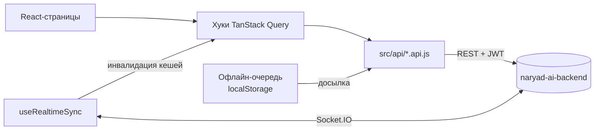

```
src/
├─ api/              axios-клиент и функции по разделам (наряды, аналитика, 1С, админка …)
├─ auth/             AuthProvider, роли, хранение токена (sessionStorage)
├─ hooks/            запросы и мутации TanStack Query, realtime, голос, офлайн-очередь
├─ offline/          очередь действий по нарядам и её обработчик
├─ routes/           AppRoutes, ProtectedRoute, RoleRoute
├─ layouts/          DashboardLayout (сайдбар + шапка), AuthLayout
├─ pages/            экраны (см. раздел 1)
├─ components/       общие компоненты, графики, канбан, модалки, ввод помощника
├─ react-components/ SmartTable, GlideSelect, CodeSlots
├─ i18n/, locales/   переводы ru / kk
scripts/             извлечение и применение i18n-ключей
docs/screenshots/    скриншоты для README
```

---

## 4. Ключевые механизмы

**Авторизация.** JWT хранится в `sessionStorage` и добавляется к каждому запросу. Ответ `401` (кроме самого входа) удаляет токен и отправляет событие `naryad:auth:unauthorized`, после чего приложение возвращает на `/login`. Ошибки сервера приводятся к `ApiError` со статусом, деталями и `retryAfter`.

**Realtime.** `useRealtimeSync` подключается к Socket.IO с тем же токеном и слушает:
- `notification:new` — новое уведомление сразу появляется в колокольчике;
- `work-order:changed` — сбрасываются кеши нарядов, панели и аналитики, экраны обновляются без перезагрузки.

При переподключении сокета отправляется офлайн-очередь.

**Офлайн-очередь.** Если действие по наряду не ушло из-за сети, оно сохраняется в `localStorage` (отдельно для каждого пользователя, до 500 записей) с уникальным `clientActionId`. При возврате сети или сокета очередь досылается по порядку. Сервер по `clientActionId` не выполняет действие дважды.

**Голосовой ввод.** `useVoiceInput` записывает звук через `MediaRecorder` (подбирает поддерживаемый формат), показывает волну и таймер и отправляет запись в `POST /api/ai/transcribe`. Используется в помощнике и в отчёте о выполнении.

**Локализация.** Все строки интерфейса берутся из `ru.json` / `kk.json`. Язык меняется в шапке или в настройках, применяется сразу. Скрипты `npm run i18n:extract | i18n:apply | i18n:reactive` выносят захардкоженные строки в ключи.

**Адаптивность.** На узких экранах сайдбар становится выезжающим меню, таблицы прокручиваются.

---

## 5. Установка и запуск

Требуется Node.js 20+ и запущенный [naryad-ai-backend](../naryad-ai-backend).

```bash
npm install
echo "VITE_API_URL=http://localhost:3000" > .env   # адрес backend
npm run dev        # http://localhost:3201
```

Сборка и предпросмотр:

```bash
npm run build      # результат в dist/
npm run preview
npm run lint
```

`dist/` — статика, её можно раздавать любым веб-сервером. Для SPA нужен fallback всех путей на `index.html`.

---

## 6. Конфигурация

| Переменная | Назначение |
|---|---|
| `VITE_API_URL` | Базовый адрес backend: REST и Socket.IO. Без неё используется адрес по умолчанию из `src/api/client.js` |

Dev-сервер слушает `0.0.0.0:3201` (`vite.config.js`). Домен `hack.fenixkst.kz` разрешён в `server.allowedHosts`; новый домен нужно добавить туда же.

На сервере проект работает в pm2 от пользователя `www` (`ecosystem.config.cjs`, процесс `hackathon-crm`, Vite dev-сервер):

```bash
sudo -u www -H pm2 start ecosystem.config.cjs && sudo -u www -H pm2 save
sudo -u www -H pm2 restart hackathon-crm
sudo -u www -H pm2 logs hackathon-crm
```

---

## 7. Используемые API

Все запросы описаны в `src/api/`. Полная документация — в backend: `docs/FRONTEND.md`.

| Группа | Эндпоинты |
|---|---|
| Авторизация | `POST /api/auth/login`, `GET /api/auth/me`, `POST /api/auth/change-password` |
| Наряды | `GET/POST /api/work-orders`, `GET /api/work-orders/board`, `GET/PATCH /api/work-orders/:id`, `POST …/:id/action`, `…/:id/reassign`, `…/:id/comment`, `GET …/:id/report` |
| Файлы и голос | `POST /api/uploads`, `POST /api/ai/transcribe` |
| Справочники | `GET /api/references/{areas,equipment,fault-codes,materials,brigades,normatives,executors}` |
| Оборудование | `GET /api/equipment/:id/history`, `GET /api/equipment/:id/qr.png` |
| Рекомендации | `/api/recommendations/executors`, `/api/recommendations/work` |
| Аналитика | `GET /api/analytics/dashboard`, `…/failure-forecast`, `…/anomalies`, `POST …/anomalies/run` |
| Помощник | `POST /api/assistant/chat`, `GET /api/assistant/history` |
| Отчёты | `GET /api/reports/{shift,ratings,brigade-ratings,my-rating,materials,downtime}`, `GET /api/reports/work-order/:id(.pdf)`, `GET /api/reports/export.{pdf,xlsx}` |
| Уведомления | `GET /api/notifications`, `PATCH /api/notifications/:id/read` |
| 1С | `GET /api/integrations/1c/jobs`, `POST …/jobs/:id/retry`, `GET …/mappings`, `POST …/run`, `POST …/push/orders`, `GET /api/integrations/orders` |
| Админка | CRUD `/api/admin/{users,areas,equipment,fault-codes,materials,brigades,normatives}`, `PATCH /api/admin/users/:id/shift` |
